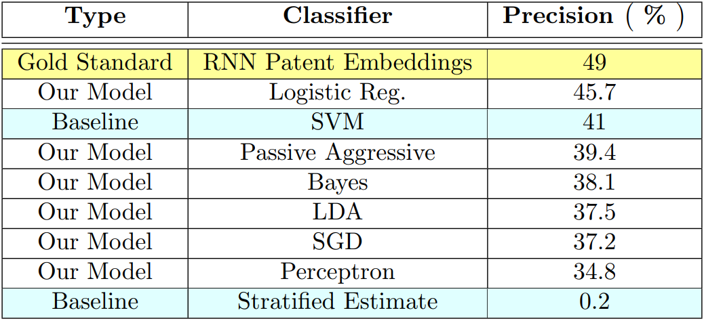
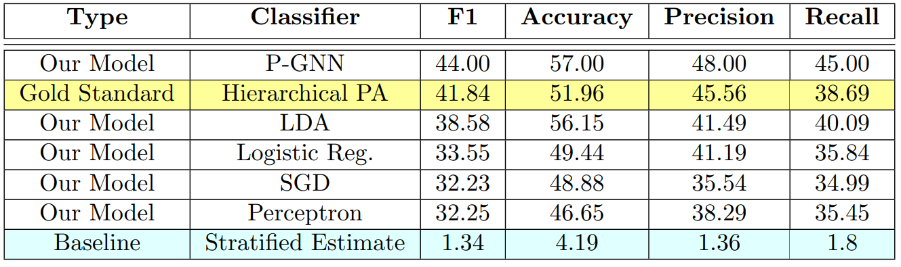

# AIT 690 | P-GNN based Patent Classification
### Billy Ermlick - team member, contributed to all parts, focused on parser, problem formulation, and factory
### Xiaojie Guo - team member, contributed to all parts, focused on GNN, and documentation
### Nidhi Mehrotra- team member, contributed to all parts, focused on factory and documentation

##
This project proposes a novel patent graphical neural network (P-GNN) approach for the task of automated patent classification. Two experiments are performed on the benchmarked WIPO-alpha dataset. Experiment 1 utilizes the entire data set to make predictions at the Subclass level. Experiment 2 utilizes Section D of the dataset to make predictions at the maingroup level.

  
***It is recommended that you run Experiment 2 first.***  
**Experiment 1 requires you to download the parsed dataset from the Google Drive link below and takes several hours to run.**
      
## Data Extraction:

The file parser.py dictates how the training and text set data were extracted from the given XML files and into a CSV format. Downloads of the CSV files are given below as they are too large to store in GitHUB.

## Data Processing:

The file factory.py is used to process the raw dataset and embed the patent documents into feature vectors. The output of this file is train-D.npy, test-D.npy, train_label-D.npy and test_label-D.npy, as well as the saved classifiers and confusion matrix plots.

## Experiment 1

It utilizes a stacked TF-IDF feature matrix on the extracted title, abstract, claims, and description. Grid search tuning is performed to achieve results comparable to others in the field.

To run the models in experiment 1, 
1) Download WIPO-alpha-train.csv and WIPO-alpha-test.csv from link below... or use parser.py on web provided dataset 
2) Change lines 392 and 393 to "False"  
3) Change line 394 to 1  

Then use the command:

     python factory.py

## Experiment 2

It implements the P-GNN model on a subset of the dataset, outperforming previous methods conducted by others in the patent classification field. Improvements in the current P-GNN model to handle larger datasets shows promising results for future classification tasks.

#### If you have not run Experiment 1: 

To use the P-GNN model in Experiment 2, use the command:

       python GNN.py

To run the baseline models in Experiment 2, use the command:

       python factory.py

Expected output:
> FINAL RESULTS | MACRO-F1  | MACRO-PRECISION | MACRO-RECALL | ACC  
LDA [0.39, 0.43, 0.4, 0.56] 
LogisticRegression [0.34, 0.41, 0.36, 0.5] 
Passive Aggressive [0.34, 0.37, 0.35, 0.51] 
SGD [0.31, 0.38, 0.33, 0.47] 
KNN [0.3, 0.32, 0.31, 0.46] 
Perceptron [0.28, 0.32, 0.34, 0.43] 
Baseline [0.02, 0.03, 0.03, 0.04] 
script finished in  2.7475 minutes 

#### If you have run Experiment 1:  
1) Change lines 392 and 393 to "False"  
2) Change line 394 to 2  
3) Run  "python factory.py" and then "python GNN.py" 

   
## Dataset / GitHub
The parsed data is available for download via: https://drive.google.com/drive/folders/1gOBlngdaolH7OUROw3pgA02R1vEtHzM5?usp=sharing

The offical dataset is available via: https://www.wipo.int/classifications/ipc/en/ITsupport/Categorization/dataset/wipo-alpha-readme.html

Github site: https://github.com/ermlickw/AIT690.git

